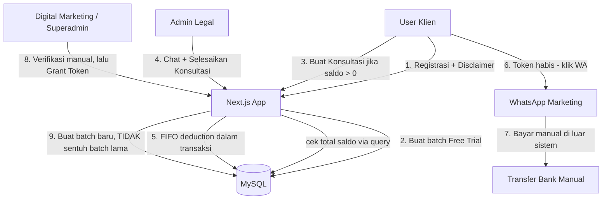

# Architecture — FHRI Legal Advisory Platform

`legal.firsthrindonesia.com`

Versi: 0.1 | Tanggal: 18 Agustus 2026
Sumber: `PRD_FHRI_Legal_Advisory_v0_1.md`

> Dokumen ini menerjemahkan PRD (fungsional/bisnis) menjadi keputusan teknis: struktur proyek, skema route, alur data, dan penanganan concurrency — khususnya untuk logika Batch/FIFO token (PRD §6) yang jadi bagian paling kritis dari sistem ini.

---

## 1. Prinsip Desain

1. **Satu sumber kebenaran untuk saldo token** — tidak ada kolom saldo yang di-cache di `users`. Saldo selalu dihitung dari `token_batches` saat dibutuhkan (PRD §6.3, §7.3).
2. **Tidak ada cron/scheduled job** untuk urusan expiry token. Status expired dihitung langsung di query (`WHERE expiry_date >= NOW()`).
3. **Batch bersifat immutable setelah dibuat** — `expiry_date` dan `jumlah_token_awal` tidak pernah di-update. Hanya `sisa_token` yang berkurang, itu pun lewat satu jalur saja (FIFO deduction).
4. **Setiap perubahan saldo (nambah/pakai) WAJIB lewat transaksi DB** — mengingat ini shared hosting (Hostinger, MySQL, tanpa message queue), race condition harus dicegah di level transaksi + row lock, bukan di level aplikasi/optimistic retry.
5. **Website tidak menyentuh uang** — tidak ada payment gateway, tidak ada webhook finansial. Semua endpoint yang mengubah saldo hanya bisa dipicu oleh role internal (`digital_marketing`, `superadmin`) atau `admin_legal` (untuk pemotongan).
6. **Sesuai skala aktual**: ini portal B2B internal-facing, bukan aplikasi konsumen skala besar. Keputusan arsitektur condong ke "sederhana & benar" dibanding "scalable tapi over-engineered" — konsisten dengan keputusan PRD soal enkripsi dokumen (di-skip) dan payment gateway (di-skip).

## 2. Tech Stack

| Layer | Pilihan | Catatan |
|---|---|---|
| Framework | Next.js (App Router) | Frontend + Backend (API Routes) dalam satu proyek |
| Styling | TailwindCSS | |
| Database | MySQL (Hostinger shared hosting) | Database terpisah dari company profile |
| DB Access | `mysql2` (driver langsung, dengan connection pool) | PRD checklist menyebutkan `mysql2`, bukan Prisma — beda dengan proyek CMS admin panel yang pakai Prisma. Dipertahankan sesuai PRD untuk menghindari overhead ORM di hosting terbatas. |
| Auth | Session-based (cookie, HttpOnly) | Password hashing pakai bcrypt/argon2 |
| Chat realtime | API Polling (SWR / `setInterval`) | Bukan Pusher/WebSocket — sesuai batasan shared hosting |
| File storage | Filesystem lokal di server, folder privat di luar `/public/` | Diakses lewat API route terautentikasi |
| Upload handling | `multer` (atau `formidable`, dievaluasi saat implementasi) | Validasi MIME type + size limit di server, bukan hanya client |
| Deployment | Node.js App di Hostinger (Passenger/Node.js App Manager) | Subdomain `legal.firsthrindonesia.com` |

## 3. Diagram Alur Sistem (Level Tinggi)



## 4. Struktur Proyek (Next.js App Router)

```
fhri-legal/
├── .env.local                          # kredensial DB, session secret — TIDAK di-commit
├── src/
│   ├── app/
│   │   ├── (public)/
│   │   │   ├── login/page.tsx
│   │   │   ├── register/page.tsx
│   │   │   └── disclaimer/page.tsx
│   │   ├── (user)/
│   │   │   ├── dashboard/page.tsx          # total saldo + rincian batch + konsultasi berjalan
│   │   │   ├── consultations/
│   │   │   │   ├── new/page.tsx            # validasi maks 1 konsultasi aktif
│   │   │   │   ├── [id]/page.tsx           # room chat / read-only jika closed
│   │   │   │   └── history/page.tsx
│   │   ├── (admin-legal)/
│   │   │   ├── inbox/page.tsx              # queue tiket
│   │   │   └── case/[id]/page.tsx          # accept, chat, Selesaikan Konsultasi
│   │   ├── (internal-admin)/               # digital_marketing + superadmin
│   │   │   ├── grant-token/page.tsx
│   │   │   ├── packages/page.tsx           # CRUD paket (superadmin only)
│   │   │   ├── settings/page.tsx           # app_settings (superadmin only)
│   │   │   └── audit-log/page.tsx          # riwayat token_batches per user
│   │   └── api/
│   │       ├── auth/
│   │       │   ├── register/route.ts
│   │       │   ├── login/route.ts
│   │       │   └── logout/route.ts
│   │       ├── users/
│   │       │   └── me/balance/route.ts     # GET total saldo + rincian batch
│   │       ├── consultations/
│   │       │   ├── route.ts                # POST buat konsultasi (cek saldo dulu)
│   │       │   ├── [id]/route.ts           # GET detail
│   │       │   ├── [id]/messages/route.ts  # GET (polling) / POST kirim pesan
│   │       │   ├── [id]/close/route.ts     # POST Selesaikan Konsultasi -> FIFO deduction
│   │       │   └── [id]/force-close/route.ts
│   │       ├── files/
│   │       │   └── [fileId]/route.ts       # serve dokumen privat, cek sesi + kepemilikan
│   │       ├── admin/
│   │       │   ├── grant-token/route.ts    # POST -> buat batch baru
│   │       │   ├── packages/route.ts       # CRUD token_packages (superadmin)
│   │       │   ├── settings/route.ts       # CRUD app_settings (superadmin)
│   │       │   └── users/search/route.ts   # cari user via email/no. WA
│   │       └── cron/                       # TIDAK DIPAKAI — sengaja kosong, lihat §1 poin 2
│   ├── lib/
│   │   ├── db.ts                           # mysql2 connection pool
│   │   ├── session.ts                      # auth session helper
│   │   ├── tokenBalance.ts                 # query total saldo + rincian batch (§6.3)
│   │   ├── tokenGrant.ts                   # buat batch baru (§6.1/6.2/6.3)
│   │   ├── tokenDeduct.ts                  # FIFO deduction dalam transaksi (§6.4)
│   │   └── upload.ts                       # validasi MIME/size, sanitasi nama file
│   └── middleware.ts                       # proteksi route berdasarkan role
├── storage/
│   └── consultation-docs/                  # DI LUAR /public, tidak web-accessible langsung
└── package.json
```

## 5. Modul Inti: Token Balance & Batch (jantung sistem)

### 5.1 `lib/tokenBalance.ts` — Baca saldo

```sql
-- Total saldo (dipakai di dashboard & validasi buat-konsultasi)
SELECT COALESCE(SUM(sisa_token), 0) AS total_saldo
FROM token_batches
WHERE user_id = ? AND expiry_date >= NOW();

-- Rincian per batch (dipakai di dashboard, urut expiry terdekat)
SELECT id, source_type, sisa_token, expiry_date
FROM token_batches
WHERE user_id = ? AND expiry_date >= NOW() AND sisa_token > 0
ORDER BY expiry_date ASC;
```

Kedua query ini **read-only**, tidak butuh lock — aman dipanggil kapan pun (load dashboard, sebelum submit form konsultasi, dsb).

### 5.2 `lib/tokenGrant.ts` — Buat batch baru (PRD §6.1–6.3)

```
function grantToken(userId, { sourceType, packageId, jumlahToken, masaBerlakuHari, grantedBy, catatan }):
  expiryBaru = today() + masaBerlakuHari   // MURNI dari hari ini, tidak lihat batch lain
  INSERT INTO token_batches
    (user_id, source_type, package_id, jumlah_token_awal, sisa_token, expiry_date, granted_by, catatan, created_at)
  VALUES
    (userId, sourceType, packageId, jumlahToken, jumlahToken, expiryBaru, grantedBy, catatan, NOW())
```

Dipanggil dari 3 tempat: (a) registrasi user baru → `sourceType='free_trial'`, `grantedBy=NULL`; (b) `POST /api/admin/grant-token` jalur paket; (c) jalur manual (`packageId=NULL`, wajib `catatan`).

**Tidak ada langkah "cek/update batch lama"** — ini yang membedakan dari model *extend* di draf lama. Fungsi ini murni `INSERT`, tidak pernah `UPDATE` baris lain.

### 5.3 `lib/tokenDeduct.ts` — FIFO deduction (PRD §6.4)

```
function deductOneToken(userId, consultationId):
  BEGIN TRANSACTION

  batch = SELECT id, sisa_token FROM token_batches
          WHERE user_id = ? AND sisa_token > 0 AND expiry_date >= NOW()
          ORDER BY expiry_date ASC
          LIMIT 1
          FOR UPDATE            -- row lock, cegah race condition antar-admin

  IF batch IS NULL:
      ROLLBACK
      THROW "Saldo token user sudah habis"

  UPDATE token_batches SET sisa_token = sisa_token - 1 WHERE id = batch.id
  UPDATE consultations SET status = 'closed', batch_id_terpakai = batch.id WHERE id = consultationId

  COMMIT
```

Dipanggil dari `POST /api/consultations/[id]/close` dan `POST /api/consultations/[id]/force-close` — **satu fungsi yang sama**, tidak ada logika pemotongan ganda (PRD §6.4 poin terakhir).

> Catatan implementasi MySQL: pastikan isolation level default (`REPEATABLE READ`) + `FOR UPDATE` cukup untuk mengunci baris batch yang dipilih. Karena volume transaksi rendah (bukan sistem finansial berkecepatan tinggi), tidak dibutuhkan optimistic locking tambahan.

## 6. Autentikasi & Otorisasi

- Session cookie (HttpOnly, `Secure` di production) berisi `user_id` + `role`, disimpan server-side (tabel `sessions` atau JWT ditandatangani server — dipilih saat implementasi; default rekomendasi: session token opaque di cookie + lookup DB, lebih mudah di-revoke daripada JWT).
- `middleware.ts` memetakan role → route group yang boleh diakses:
  - `user` → `(user)/*`
  - `admin_legal` → `(admin-legal)/*`
  - `digital_marketing` → `(internal-admin)/grant-token`, `(internal-admin)/audit-log` (read-only untuk packages/settings)
  - `superadmin` → seluruh `(internal-admin)/*`
- Semua API route di `app/api/admin/**` memvalidasi role di server (bukan hanya menyembunyikan UI) — mencegah akses langsung via curl/Postman oleh role yang salah.

## 7. File Upload & Serving Dokumen

1. Upload masuk lewat `multer`/`formidable` di API route, divalidasi MIME type + size (PRD §7.1) **di server**, bukan hanya `accept=".pdf"` di client.
2. Nama file di-sanitasi + diberi prefix timestamp + `userId`, disimpan ke `storage/consultation-docs/` (di luar `/public/`, di luar root yang di-serve Next.js statis).
3. Path fisik disimpan di `messages.file_url` sebagai path internal, **bukan URL yang bisa diakses langsung**.
4. Saat user/admin klik unduh, request masuk ke `GET /api/files/[fileId]` → route ini: cek sesi login → cek apakah `sender_id`/consultation terkait milik user tsb (atau requester adalah admin/superadmin) → baru stream file dari disk. Tidak ada endpoint yang mengembalikan path publik.

## 8. Chat (API Polling)

- Client poll `GET /api/consultations/[id]/messages?after=<lastMessageId>` tiap beberapa detik (SWR `refreshInterval`) selama konsultasi berstatus `active`.
- Polling berhenti otomatis saat status `closed` (riwayat read-only, tidak perlu polling lagi — cukup fetch sekali).
- Banner "di luar jam kerja" dihitung di client dari nilai `app_settings.jam_kerja_*` yang di-fetch bersamaan dengan load halaman chat, dibandingkan waktu lokal.

## 9. Deployment (Hostinger)

- Subdomain `legal.firsthrindonesia.com` diarahkan ke aplikasi Node.js terpisah (bukan satu app dengan company profile), lewat Hostinger Node.js App Manager.
- Environment variables (`DB_HOST`, `DB_USER`, `DB_PASS`, `DB_NAME`, `SESSION_SECRET`, `STORAGE_PATH`) diisi lewat panel Hostinger, bukan hardcode di kode.
- Build: `npm run build` → `npm run start` (Next.js production server), dikelola Passenger/Node.js App Manager Hostinger sesuai dokumentasi mereka.
- Folder `storage/consultation-docs/` harus dibuat manual di server dengan permission tulis untuk user proses Node.js, dan dipastikan **tidak** berada di dalam `public/`.

## 10. Keamanan — Ringkasan Lintas Dokumen

| Area | Keputusan | Sumber |
|---|---|---|
| Pembayaran | Tidak ada di website sama sekali | PRD §1, §9 |
| Dokumen upload | Folder privat + API route terautentikasi, tanpa enkripsi at-rest (dianggap over-engineering untuk skala ini) | PRD §7.2 |
| Saldo token | Sumber kebenaran tunggal di `token_batches`, semua mutasi lewat transaksi | Arsitektur §5, PRD §7.4 |
| Free trial abuse | Unique constraint email + no. WA | PRD §7.5 |
| Role access | Divalidasi di middleware DAN di setiap API route (defense in depth) | Arsitektur §6 |

## 11. Keputusan Teknis Terbuka

- **Session store**: opaque token + tabel `sessions` di MySQL vs JWT — direkomendasikan opaque token untuk kemudahan revoke (misal saat admin di-nonaktifkan), keputusan final saat mulai coding auth.
- **Library upload**: `multer` vs `formidable` — keduanya kompatibel dengan App Router route handlers, dipilih saat implementasi berdasarkan kemudahan integrasi dengan Next.js 14+ Request/Response API.
- **Pagination rincian batch di dashboard** (mengikuti open question PRD §10) — belum berdampak ke arsitektur inti, bisa ditambahkan sebagai `LIMIT`/`OFFSET` di query §5.1 tanpa mengubah struktur data.
